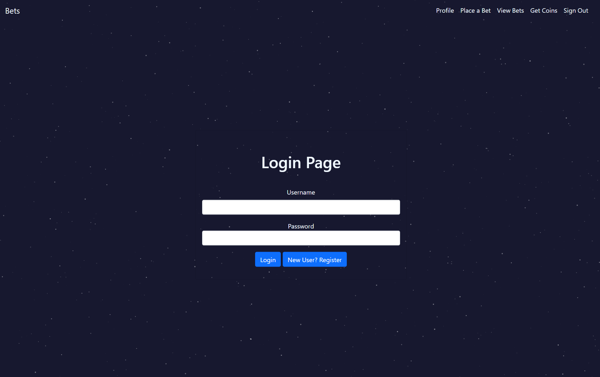

# Surprise-Mechanics  
  
  
  ## Description:  
  This project is a simple betting site. The site has several roles: users: all users start with 100 amount of tokens, must provide discord authentication. betters: can add bets and join bets. witness: has the ability to oversee and determine the result of the match. Paid tokens worth 10% of the winning pool. It also has a Slot Machine game that allows you to generate more tokens.

  ## Table of Contents:  
  - [Description](#-description)
  - [Table of Contents](#-table-of-contents)
  - [Installation](#-installation)
  - [Usage](#-usage)
  - [License](#-license)
  - [Contributing](#-contributing)
  - [Tests](#-tests)
  - [Questions](#-questions)

  ## Installation:  
  If you want to download the project and view/use the code locally   
  1. go to the Github repo.   
  2. Clone the repo.  
  3. install the dependencies with 'npm i'.   
  4. copy the Schema.sql into your mysql workbench to create the database.  
  5. create a .env file including the database, username, and password.   
  6. Run with node server.js  
  7. go to local:3000.   
  Or just go to https://dry-island-15959.herokuapp.com/.  

  ## Usage:  
  Process:  
  1. user creates a bet for a certain goal/objective.  
  2. other users can sign on to the bet in support, against, or as a witness. (each person can only join in one role; bet will not start until the bet has at least one of each)  
  3. Additional users can join in at anytime until witness chooses outcome  
  4. witness will choose outcome and tokens will be added accordingly
  
  ## License:  
  Licensed under [MIT](./LICENSE)
  
  ## Contributing:  
  Wells Wu, Alex Noriega, and Kyle Berman.
  
  ## Tests:  
  Creating bets with friends, or just enjoying some surprise mechanics with the slot machine

  
  
  ## Questions:  
  Contact Us:  
  [Wells Wu](https://gist.github.com/WellsWu4621)  
  [Kyle Berman](https://gist.github.com/WellsWu4621)  
  [Alex Noriega](https://gist.github.com/WellsWu4621)  
  Repository Link [Git Hub](https://github.com/WellsWu4621/Surprise-Mechanics)
  Deployed Link [Heroku](https://dry-island-15959.herokuapp.com/)
  

